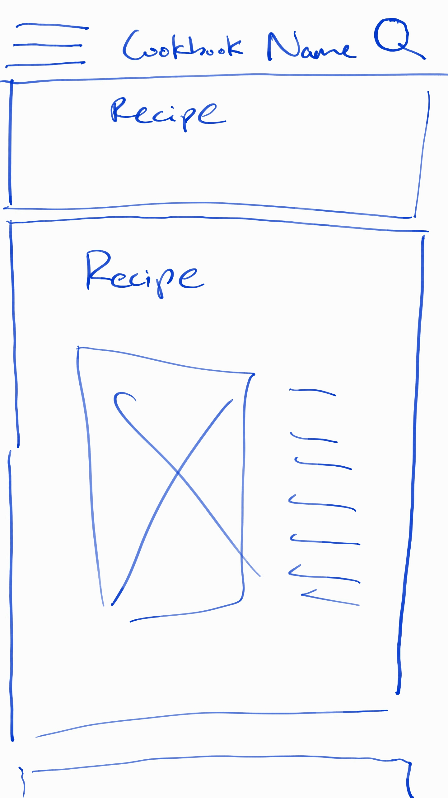
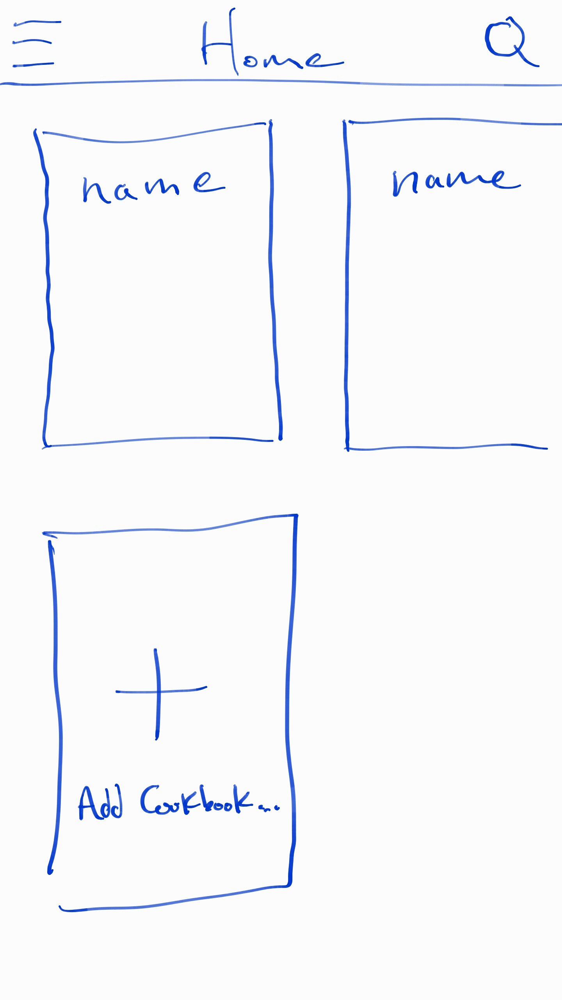
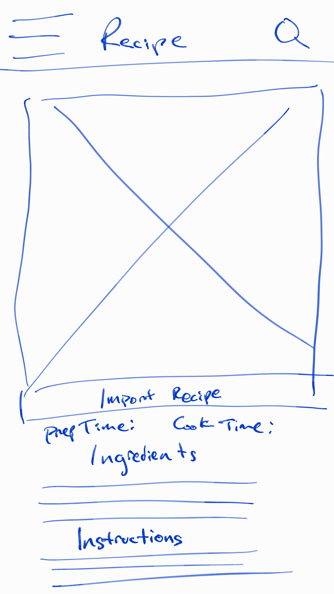
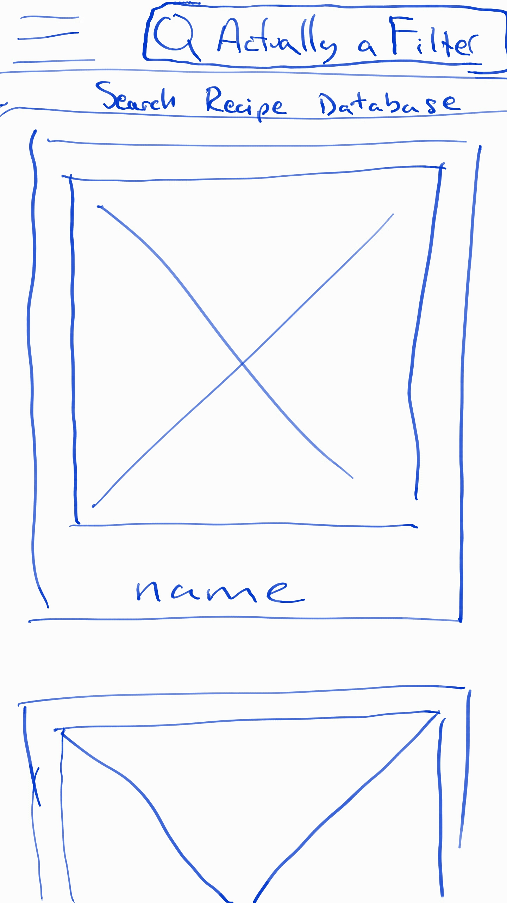

# Cookbook

### Wireframes
##### DB planning:

##### Cookbook (inside)

##### Cookbook (list view)

##### Hamburger menu prototyping

##### Recipe view

##### Local recipe search

##### Global recipe search

